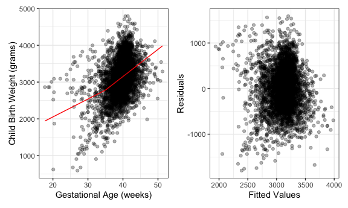
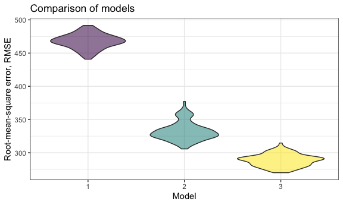
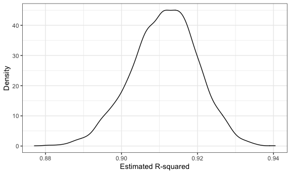
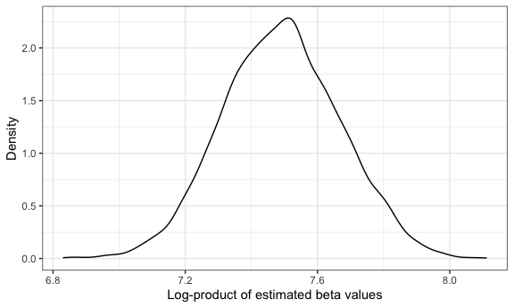

HW6: Linear Models
================
UNI: jae2186 (Jennifer Estrada)
12/6/2021

## Problem 1: Understanding factors effecting birthweight

### Data Introduction

Given data provided for 4000 children, the following code will runs a
regression analysis with several variables against birth weight. I will
be focusing on a select number of variables and employ a regression
analysis to assess how they impact birth weight; similarly, certain
measurements of the child will also be included to see if and how they
may correlate to birth weight. The selected variables of interest
include:

-   measurements and demographics taken of the child at birth -
    -   sex (either male or female),
    -   head circumference (in cm),
    -   length (in cm),
    -   birth weight (in gm), and
    -   gestational age (in weeks);
-   measurements and demographics taken of mother or family at birth -
    -   the family’s monthly income (rounded to nearest hundred of
        dollars),
    -   the mother’s pre-pregnancy BMI,
    -   average number of cigarettes smoked by the mother per day during
        pregnancy, and
    -   the mother’s age at delivery in years.

``` r
df <-
  read_csv("./data/birthweight.csv") %>% 
  mutate(babysex = as.factor(babysex),
         frace = as.factor(frace),
         mrace = as.factor(mrace), 
         malform = as.factor(malform)) %>% 
  select(-pnumlbw, -pnumsga)
```

(Note: Certain variables were removed from the data set because it was
noted there were no differences in this variable across the data set -
i.e. there were no mothers who reported a having previous low birth
weight babies (`pnumlbw`) nor prior small for gestational age babies
(`pnumsga`).)

### Setting up primary model

First I will use a piecewise linear regression to assess gestational age
in weeks (`gaweeks`) as a lone predictor of birth weight (`bwt`) with a
changepoint at 35 weeks for gestational age. The resulting plot with the
model as well as a plot of residuals against the fitted values is shown
below.

``` r
df <- 
  df %>% 
  mutate(weight_gaweeks = (gaweeks > 35) * (gaweeks - 35))

model_1_pwl <- lm(bwt ~ gaweeks + weight_gaweeks, data = df)

model_plot <-
  df %>% 
  add_predictions(model_1_pwl) %>% 
  ggplot(aes(x = gaweeks, y = bwt)) + 
  geom_point(alpha = .3) +
  geom_line(aes(y = pred), color = "red") +
  labs(
    x = "Gestational Age (weeks)",
    y = "Child Birth Weight (grams)")

resid_plot <-
  df %>% 
  add_predictions(model_1_pwl) %>% 
  add_residuals(model_1_pwl) %>% 
  ggplot(aes(x = pred, y = resid)) + 
  geom_point(alpha = .3) +
  labs(
    x = "Fitted Values",
    y = "Residuals")

model_plot + resid_plot
```



### Setting up comparison models

The following two models will be compared to the one used above. The
first one will use length at birth and gestational age as predictors but
will only look at the main effect and not the individual interactions.
The second one uses head circumference, length, and sex as predicts
keeping in consideration all of their interactions as well (both two-
and three-way interactions). In both cases a linear model will be
applied.

``` r
model_2_lm <-
  lm(bwt ~ blength + gaweeks, data = df)

model_3_lm <-
  lm(bwt ~ blength * bhead * babysex + blength * bhead + 
       blength * babysex + bhead * babysex, data = df)
```

The following code chunk will use cross validation and the resulting
prediction error to compare the three different models.

``` r
cv_df <- 
  crossv_mc(df, 100)

cv_df <-
  cv_df %>%  
  mutate(
    train = map(train, as_tibble),
    test = map(test, as_tibble)
  )

cv_df <-
  cv_df %>% 
  mutate(
    model_1 = map(.x = train, ~lm(bwt ~ gaweeks + weight_gaweeks, data = .x)),
    model_2 = map(.x = train, ~lm(bwt ~ blength + gaweeks, data = .x)), 
    model_3 = map(.x = train, ~lm(bwt ~ blength * bhead * babysex + blength * bhead + 
       blength * babysex + bhead * babysex, data = .x))
    ) %>% 
  mutate(
    rmse_1 = map2_dbl(.x = model_1, .y = test, ~rmse(model = .x, data = .y)),
    rmse_2 = map2_dbl(.x = model_2, .y = test, ~rmse(model = .x, data = .y)),
    rmse_3 = map2_dbl(.x = model_3, .y = test, ~rmse(model = .x, data = .y))
  )

cv_df %>% 
  select(starts_with("rmse")) %>% 
  pivot_longer(
    everything(),
    names_to = "model", 
    values_to = "rmse",
    names_prefix = "rmse_"
  ) %>%   
  ggplot(aes(x = model, y = rmse, fill = model, alpha = 0.5)) + 
  geom_violin() +
  labs(
    title = "Comparison of models",
    x = "Model",
    y = "Root-mean-square error, RMSE") +
  theme(legend.position = "none")
```



As noted, the two models used for comparison fit the data better based
solely on the resulting RSME values. The primary piecewise linear model
had notably higher RSMEs; however, considering that this model only
considered one predictor of birth weight it is not surprising that it
did not fit the data as well as models built around the interactions of
at least 2 variables. When considering the interactions of 3 different
predictors as in model 3, the error and fit of the model is improved
compared to model 2 which only looks at the main interaction of 2
predictors.

## Problem 2: Bootstrapping of Central Park weather data

### Data Introduction

Using weather data from Central Park in 2017, the following work will
explore a simple linear regression that assess maximum daily
temperatures (`tmax`) as a response to the predictor of minimum daily
temperature (`tmin`).

``` r
weather_df = 
  rnoaa::meteo_pull_monitors(
    c("USW00094728"),
    var = c("PRCP", "TMIN", "TMAX"), 
    date_min = "2017-01-01",
    date_max = "2017-12-31") %>%
  mutate(
    name = recode(id, USW00094728 = "CentralPark_NY"),
    tmin = tmin / 10,
    tmax = tmax / 10) %>%
  select(name, id, everything())
```

### Boostrapping data

Bootstrapping of the data with 5000 bootstrap samples is completed as
follows:

``` r
boot_weather <-
  weather_df %>% 
  bootstrap(5000, id = "strap_number") %>% 
  mutate(
    models = map(.x = strap, ~lm(tmax ~ tmin, data = .x)),
    results = map(models, broom::tidy),
    r_sq = map(models, broom::glance)) %>% 
  select(strap_number, results, r_sq)
```

Two estimates of interest which are not explicitly provided in the
models include:

-   
    *r*̂<sub>2</sub>
-   
    *l**o**g*(*β*̂<sub>0</sub> ∗ *β*̂<sub>1</sub>)

The distributions of these estimates among all the bootstrap samples are
then shown with the following density plots:

``` r
rsq <-
  boot_weather %>% 
  unnest(r_sq) %>% 
  select(strap_number, r.squared) %>% 
  janitor::clean_names()
  
rsq %>% 
  ggplot(aes(x = r_squared)) + 
  geom_density() + 
  labs(
    x = "Estimated R-squared",
    y = "Density")
```



The above density plot for the estimated r-squared values shows a very
slightly longer lower tail indicating that there might be some lower
outliers but overall the distribution appears to be normal with a
distribution centered between 0.90 and 0.92 (but closer to 0.92).

``` r
log_beta <-
  boot_weather %>%
  unnest(results) %>% 
  select(strap_number, term, estimate) %>% 
  pivot_wider(names_from = term, values_from = estimate) %>% 
  janitor::clean_names() %>% 
  mutate(log_beta = intercept * tmin)


log_beta %>% 
  ggplot(aes(x = log_beta)) + 
  geom_density() + 
  labs(
    x = "Log-product of estimated beta values",
    y = "Density")
```



The above density distribution for the log-product of the two beta
values (i.e. the estimates for the intercept
*β*̂<sub>0</sub>
and tmax
*β*̂<sub>1</sub>
also apprears to have a relatively normal dsitribtion about 7.5 but has
a much sharper peak rather than being smooth.

``` r
rsq %>% 
  summarize(
    ci_lower = quantile(r_squared, 0.025), 
    ci_upper = quantile(r_squared, 0.975)
  ) %>% 
  knitr::kable(digits = 3, 
               col.names = c("Lower interval", "Upper interval"),
               caption = "95% confidence interval for estimated R-squared values")
```

| Lower interval | Upper interval |
|---------------:|---------------:|
|          0.894 |          0.927 |

95% confidence interval for estimated R-squared values

``` r
log_beta %>% 
  summarize(
    ci_lower = quantile(log_beta, 0.025), 
    ci_upper = quantile(log_beta, 0.975)
  ) %>% 
  knitr::kable(digits = 3, 
               col.names = c("Lower interval", "Upper interval"),
               caption = "95% confidence interval for the log-product of the estimated beta-values")
```

| Lower interval | Upper interval |
|---------------:|---------------:|
|          7.149 |          7.834 |

95% confidence interval for the log-product of the estimated beta-values

The resulting 95% confidence intervals are noted to be:

-   for the estimated R-squares: a lower confidence interval of 0.894
    and upper interval of 0.927, and
-   for the log-product of the estimated beta values: a lower confidence
    interval of 7.149 and upper interval of 7.834.
